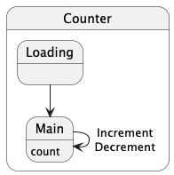

# Tart

<div align="center">
  
</div>

Tart is a Flux framework for Kotlin Multiplatform.

- Data flow is one-way, making it easy to understand.
- Since the state during processing is unchanged, there is no need to be aware of side effects.
- Code becomes declarative.
- Works on multiple platforms (Currently on Android and iOS).

I used [Flux](https://facebookarchive.github.io/flux/) and [UI layer](https://developer.android.com/topic/architecture/ui-layer) as a reference for the design, and [Macaron](https://github.com/fika-tech/Macaron) for the implementation.

## Installation

```kt
implementation("io.yumemi.tart:tart-core:<latest-release>")
```

## Usage

### Basic

Take a simple counter as an example.
First, prepare classes for *State*, *Action*, and *Event*.

- *State*: state of the UI
- *Action*: action on the UI by the application user
- *Event*: event that is notified to the UI

```kt
data class CounterState(val count: Int) : State

sealed interface CounterAction : Action {
    data class Set(val count: Int) : CounterAction
    data object Increment : CounterAction
    data object Decrement : CounterAction
}

sealed interface CounterEvent : Event {} // currently empty
```

Create a *Store* class from `Store.Base` by specifying the initial state.
Keep the *Store* class instance in the ViewModel etc.

```kt
class CounterStore : Store.Base<CounterState, CounterAction, CounterEvent>(
    initialState = CounterState(count = 0),
)
```

Overrides the `onDispatch()` method and define how the *State* is changed by *Action*.

```kt
class CounterStore : Store.Base<CounterState, CounterAction, CounterEvent>(
    initialState = CounterState(count = 0),
) {
    override suspend fun onDispatch(state: CounterState, action: CounterAction): CounterState = when (action) {
        is CounterAction.Set -> {
            state.copy(count = action.count)
        }

        is CounterAction.Increment -> {
            state.copy(count = state.count + 1)
        }

        is CounterAction.Decrement -> {
            if (0 < state.count) {
                state.copy(count = state.count - 1)
            } else {
                state // do not change State
            }
        }
    }
}
```

Issue an *Action* from the UI using the Store's `dispatch()` method.

```kt
// example in Compose
Button(
    onClick = { store.dispatch(CounterAction.Increment) },
) {
    Text(text = "increment")
}
```

The new *State* will be reflected in the Store's `.state` (StateFlow), so draw it to the UI.

### Notify event to UI

Prepare classes for *Event*.

```kt
sealed interface CounterEvent : Event {
    data class ShowToast(val message: String) : CounterEvent
    data object NavigateToNextScreen : CounterEvent
}
```

In the `dispatch()` method body, issue an *Event* using the `emit()` method.

```kt
is CounterAction.Decrement -> {
    if (0 < state.count) {
        state.copy(count = state.count - 1)
    } else {
        emit(CounterEvent.ShowToast("Can not Decrement.")) // issue event
        state
    }
}
```

Subscribe to the Store's `.event` (Flow) on the UI, and process it.

### Access to Repository, UseCase, etc.

Keep Repository, UseCase, etc. in the instance field of *Store* and use it from `dispatch()` method.

```kt
class CounterStore(
    private val counterRepository: CounterRepository, // inject to Store
) : Store.Base<CounterState, CounterAction, CounterEvent>(
    initialState = CounterState(count = 0),
) {
    override suspend fun onDispatch(state: CounterState, action: CounterAction): CounterState = when (action) {
        CounterAction.Load -> {
            val count = counterRepository.get() // load
            state.copy(count = count)
        }

        is CounterAction.Increment -> {
            val count = state.count + 1
            state.copy(count = count).apply {
                counterRepository.set(count) // save
            }
        }

        // ...
```

### Multiple states and transitions

In the previous examples, the state was single.
However, in actual application development, multiple states exist, such as the UI during data loading.
In that case, prepare multiple *States*.

```kt
sealed interface CounterState : State {
    data object Loading: CounterState 
    data class Main(val count: Int): CounterState
}
```

```kt
class CounterStore(
    private val counterRepository: CounterRepository,
) : Store.Base<CounterState, CounterAction, CounterEvent>(
    initialState = CounterState.Loading, // start from loading
) {
    override suspend fun onDispatch(state: CounterState, action: CounterAction): CounterState = when (state) {
        CounterState.Loading -> when (action) {
            CounterAction.Load -> {
                val count = counterRepository.get()
                CounterState.Main(count = count) // transition to next state
            }

            else -> state
        }

        is CounterState.Main -> when (action) {
            is CounterAction.Increment -> {
                // ...
```

In this example, the `CounterAction.Load` action needs to be issued from the UI when the application starts.
Otherwise, if you want to do something at the start of the *State*, override the `onEnter()` method.

```kt
override suspend fun onEnter(state: CounterState): CounterState = when (state) {
    CounterState.Loading -> {
        val count = counterRepository.get()
        CounterState.Main(count = count)
    }

    else -> state
}

override suspend fun onDispatch(state: CounterState, action: CounterAction): CounterState = when (state) {
    is CounterState.Main -> when (action) {
        is CounterAction.Increment -> {
            // ...
```

The state diagram is as follows:



Similarly, you can override the `onExit()` method.
This framework works well with state diagrams.
It would be a good idea to document it and share it with your team if necessary.

<details>
<summary>Tips: define extension functions for each State</summary>

Normally, code for all States is written in the body of the `onDispatch()` method.

```kt
override suspend fun onDispatch(state: MainState, action: MainAction): MainState = when (state) {
    is MainState.StateA -> when (action) {
        is MainAction.ActionA -> {
            // do something..
        }

        is MainAction.ActionB -> {
            // do something..
        }

        // ...

        else -> state
    }

    is MainState.StateB -> when (action) {
        // ...
    }

    // ...
```

This is fine if the code is simple, but if the code becomes long, define an extension function for each State.
Code for each State becomes easier to understand.

```kt
override suspend fun onDispatch(state: MainState, action: MainAction): MainState = when (state) {
    is MainState.StateA -> state.process(action)
    is MainState.StateB -> state.process(action)
    // ...
}

private suspend fun MainState.StateA.process(action: MainAction): MainState = when (action) {
    is MainAction.ActionA -> {
        // do something..
    }

    is MainAction.ActionB -> {
        // do something..
    }

    // ...

    else -> this
}

// ...
```

In addition, you can also define extension functions for `MainAction.ActionA`.

```kt
override suspend fun onDispatch(state: MainState, action: MainAction): MainState = when (state) {
    is MainState.StateA -> state.process(action)
    is MainState.StateB -> state.process(action)
    // ...
}

private suspend fun MainState.StateA.process(action: MainAction): MainState = when (action) {
    is MainAction.ActionA -> process(action)
    is MainAction.ActionB -> process(action)
    // ...
    else -> this
}

// this does not include when branches
private suspend fun MainState.StateA.process(action: MainAction.ActionA): MainState {
    // do something..
}
```

In any case, the `onDispatch()` method is a simple method that simply returns a new State from the current State and Action, so you can design the code as you like.
</details>

### Error handling

If you prepare a *State* for the error UI and handle the error, it will look like this:

```kt
sealed interface CounterState : State {
    // ...
    data class Error(val error: Throwable) : CounterState
}
```

```kt
override suspend fun onEnter(state: CounterState): CounterState = when (state) {
    CounterState.Loading -> {
        try {
            val count = counterRepository.get()
            CounterState.Main(count = count)
        } catch (t: Throwable) {
            CounterState.Error(error = t)
        }
    }

    // ...
```

This is fine, but you can also handle errors by overriding the `onError()` method.

```kt
override suspend fun onEnter(state: CounterState): CounterState = when (state) {
    CounterState.Loading -> {
        val count = counterRepository.get()
        CounterState.Main(count = count)
    }

    else -> state
}

override suspend fun onError(state: CounterState, error: Throwable): CounterState {
    return CounterState.Error(error = error)
}
```

Errors can be caught not only in `onEnter()` method but also in `onDispatch()` and `onExit()` methods.
The above example uniformly transitions to the `CounterState.Error` state, but of course it is also possible to branch the process depending on the `state` or `error` input.

### Constructor arguments when creating a Store

#### initialState [required]

Specify the first *state*.

```kt
class CounterStore : Store.Base<CounterState, CounterAction, CounterEvent>(
    initialState = CounterState.Loading,
)
```

#### coroutineContext [option]

You can pass any `CoroutieneContext`, but if it is an Android ViewModel, it will be `viewModelScope.coroutineContext`.

```kt
class CounterStore(
    coroutineContext: CoroutineContext, // pass to Store.Base
) : Store.Base<CounterState, CounterAction, CounterEvent>(
    initialState = CounterState.Loading,
    coroutineContext = coroutineContext,
)

// ...

class CounterViewModel : ViewModel() {
    val store = CounterStore(viewModelScope.coroutineContext)
}
```

In this case, the Store's Coroutines will be disposed of according to the ViewModel's lifecycle.
If you are not using ViewModel, `lifecycleScope.coroutineContext` can be used on Android.

In this way, when using `viewModelScope.coroutineContext` or `lifecycleScope.coroutineContext`, create an instance of Store in ViewModel or Activity to pass them, and inject Repository, UseCase, etc. to ViewModel or Activity.

```kt
class CounterViewModel(
    counterRepository: CounterRepository, // inject to ViewModel
) : ViewModel() {
    val store = CounterStore(
        counterRepository = counterRepository,
        coroutineContext = viewModelScope.coroutineContext,
    )
}
```

If not, you can create an instance of Store with the DI library.

#### latestState [option]

Latest *State* is notified by callback.
When saving and restoring the *State*, save the *State* notified by this callback and pass it to `initialState` when restoring.

#### onError [option]

Uncaught errors can be received with a callback.

### For iOS

Coroutines like Store's `.state` (StateFlow) and `.event` (Flow) cannot be used on iOS, so use `.collectState()` and `.collectEvent()`. If the State and Event change, you will be notified with a callback.

### Disposal of Coroutines

If you are not using an automatically disposed scope like Android's ViewModelScope or LificycleScope, call the `.dispose()` method explicitly when Store is no longer needed.
Then, processing of all Coroutines will stop.

## Compose

<details>
<summary>contents</summary>

You can use Store's `.state` (StateFlow), `.event` (Flow), and `.dispatch()` on the UI side, but we provide a mechanism for Compose.

```kt
implementation("io.yumemi.tart:tart-compose:<latest-release>")
```

Create an instance of the `ViewStore` from a Store instance using the `ViewStore#create()` method.
For example, if you have a Store in your ViewModel, it would look like this:

```kt
class MainActivity : ComponentActivity() {

    private val mainViewModel: MainViewModel by viewModels()

    override fun onCreate(savedInstanceState: Bundle?) {
        super.onCreate(savedInstanceState)

        setContent {
            // create ViewStore instance at top level of Comopse
            val viewStore = ViewStore.create(mainViewModel.store)

            MyApplicationTheme {
                Surface(
                    modifier = Modifier.fillMaxSize(),
                ) {
                    // pass as an argument to Composable component
                    YourComposableComponent(
                        viewStore = viewStore,
                    )
// ... 
```

### Rendering using State

If the *State* is single, just use ViewStore's `.state`.

```kt
Text(
    text = viewStore.state.count.toString(),
)
```

If there are multiple *States*, use `.render()` method with target *State*.

```kt
viewStore.render<CounterState.Main> {
    Text(
        text = state.count.toString(),
    )
}
```

When drawing the UI, if it does not match the target *State*, the `.render()` will not be executed.
Therefore, you can define components for each *State* side by side.

```kt
viewStore.render<CounterState.Loading> {
    Text(
        text = "loading..",
    )
}

viewStore.render<CounterState.Main> {
    Text(
        text = state.count.toString(),
    )
}
```

In this case, `this` inside the `render()` block is a new *ViewStore* instance according to *State*.
If you use another component in the `render()` block, pass its instance.

```kt
store.render<CounterState.Main> {
    YourComposableComponent(
        viewStore = this, // ViewStore instance for CounterState.Main
    )
}

// ...

@Composable
fun YourComposableComponent(
    viewStore: ViewStore<CounterState.Main, CounterAction, CounterEvent>,
) {
    // Main state is confirmed
    Text(text = viewStore.state.count.toString())
}
```

### Dispatch Action

Use ViewStore's `.dispatch()` method with target *Action*.

```kt
Button(
    onClick = { viewStore.dispatch(CounterAction.Increment) },
) {
    Text(text = "increment")
}
```

### Event handling

Use ViewStore's `.handle()` method with target *Event*.

```kt
viewStore.handle<CounterEvent.ShowToast> { event ->
    // do something..
}
```

You can also subscribe to parent *Event* types.

```kt
viewStore.handle<CounterEvent> { event ->
    when (event) {
        is CounterEvent.ShowToast -> // do something..
        is CounterEvent.GoBack -> // do something..
        // ...
    }
```

### Mock for preview and testing

Create a mock instance using `ViewStore.mock()`.

```kt
@Preview
@Composable
fun LoadingPreview() {
    MyApplicationTheme {
        YourComposableComponent(
            viewStore = ViewStore.mock(
                state = CounterState.Loading,
            ),
        )
    }
}
```

Therefore, by defining only the *State*, it is possible to develop the UI even before implementing the *Store*.
</details>

## Middleware

<details>
<summary>contens</summary>

You can create extensions that work with the Store.
To do this, create a class that implements the `Middleware` interface and override the necessary methods.

```kt
class YourMiddleware<S : State, A : Action, E : Event> : Middleware<S, A, E> {
    override suspend fun afterStateChange(state: S, prevState: S) {
        // do something..
    }
}
```

Apply Middleware to Store as follows:

```kt
class MainStore(
    // ...
) : Store.Base<MainState, MainAction, MainEvent>(
    // ...
) {
    override val middlewares: List<Middleware<MainState, MainAction, MainEvent>> = listOf(
        // add Middleware instance to List
        YourMiddleware(),
        // or, implement here
        object : Middleware<MainState, MainAction, MainEvent> {
            override suspend fun afterStateChange(state: MainState, prevState: MainState) {
                // do something..
            }
        },
    )

// ...
```

Since each method of Middleware is a suspending function, it operates in synchronization with Store, so you can create an extension that is completely synchronized with Store.
However, since it will interrupt the Store process, you should prepare a new CoroutineScope for long processes.

Also note that State is read-only in Middleware.

In the next section, we will introduce pre-prepared Middleware.
The source code is the `:tart-logging` and `:tart-message` modules in this repository, so you can use it as a reference for your Middleware implementation.

### Logging

Middleware that outputs logs for debugging and analysis.

```kt
implementation("io.yumemi.tart:tart-logging:<latest-release>")
```

```kt
override val middlewares: List<Middleware<MainState, MainAction, MainEvent>> = listOf(
    LoggingMiddleware(),
)
```

The implementation of the `LoggingMiddleware` is [here](tart-logging/src/commonMain/kotlin/io/yumemi/tart/logging/LoggingMiddleware.kt), change the arguments or override
the class as necessary.
If you want to change the logger, prepare a class that implements the `Logger` interface.

```kt
override val middlewares: List<Middleware<MainState, MainAction, MainEvent>> = listOf(
    object : LoggingMiddleware<MainState, MainAction, MainEvent>(
        logger = YourLogger()
    ) {
        override suspend fun beforeStateEnter(state: MainState) {
            // do something..
        }
    },
)
```

### Message

Middleware for sending messages between Stores.

```kt
implementation("io.yumemi.tart:tart-message:<latest-release>")
```

Prepare a class with a `Message` interface.

```kt
interface MainMessage : Message {
    data object LogoutCompleted : MainMessage
    data class CommentLiked(val commentId: Int) : MainMessage
    // ...
}

```

Apply `MessageSendMiddleware` to the Store that sends messages.

```kt
override val middlewares: List<Middleware<MainState, MainAction, MainEvent>> = listOf(
    object : MessageSendMiddleware<MainState, MainAction, MainEvent>() {
        override suspend fun onEvent(event: MainEvent, send: SendFun, store: Store<MainState, MainAction, MainEvent>) {
            when (event) {
                is MainEvent.NofityLogout -> send(MainMessage.LogoutCompleted)
                // ...
            }
        }
    },
)
```

Apply `MessageReceiveMiddleware` to the Store that receives messages.

```kt
override val middlewares: List<Middleware<SubState, SubAction, SubEvent>> = listOf(
    object : MessageReceiveMiddleware<SubState, SubAction, SubEvent>() {
        override suspend fun receive(message: Message, store: Store<SubState, SubAction, SubEvent>) {
            when (message) {
                is MainEvent.LogoutCompleted -> store.dispatch(SubAction.doLogout)
                // ...
            }
        }
    },
)
```
</details>
